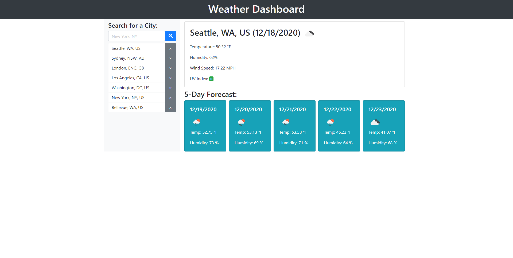

# Weather Dashboard (Homework-06)

## Description

This is a dashboard to display weather data including the current weather and 5-day forecast for any location, written in HTML and JavaScript. It uses APIs to get location and weather data. The search history and last searched location are stored locally, and will be displayed when the page is loaded.

[Deployed here on Github Pages](https://johndjake.github.io/weather-dashboard/).

## Usage

Enter a location in the search field to see the weather at that location. Click on any of the locations in the search history below the searchbar to see the weather at that location. If you don't get the location you expect, try being more specific (eg. City, State instead of just City). Try any location, even a specific address!

## Credits

* Made with [Bootstrap](https://getbootstrap.com).
* Made with [jQuery](https://jquery.com/).
* Made using an icon from [Font Awesome](https://fontawesome.com/).
* Geodata copyright [OpenStreetMap](https://www.openstreetmap.org/) contributors.
* Geodata retreived using [OpenCage Geocoding API](https://opencagedata.com/).
* Weather data from [OpenWeatherMap API](https://openweathermap.org/).
* Dates displayed using [Luxon](https://moment.github.io/luxon/index.html).
* Thanks to Anthony Mitchell, Kevin Willig, Tim Keller, S.D. Mullaney, and Mitch Bean for helping by trying to break the location search!

## License

MIT License

Copyright (c) 2020 John Jacobson

Permission is hereby granted, free of charge, to any person obtaining a copy
of this software and associated documentation files (the "Software"), to deal
in the Software without restriction, including without limitation the rights
to use, copy, modify, merge, publish, distribute, sublicense, and/or sell
copies of the Software, and to permit persons to whom the Software is
furnished to do so, subject to the following conditions:

The above copyright notice and this permission notice shall be included in all
copies or substantial portions of the Software.